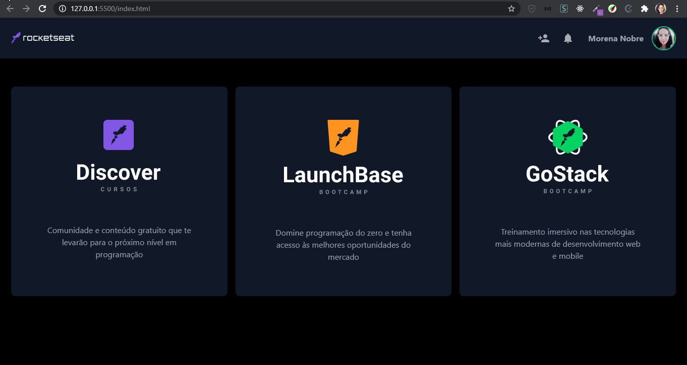

<h1 align="center">Workshop Tailwindcss com Mayk Brito</h1>

  
  

<blockquote align="center">“A chave para transformação é a continuidade. Continue a codar!”</blockquote>

 

 
 

## Apresentação 
 

  

 

## Sobre o projeto
 

    Desenvolvimento de clone da Dashboard da Rocketseat utilizando Tailwindcss - Workshop do Mayk Brito (DoWhile).

 

## Tecnologias Utilizadas
 

- [x] Tailwindcss
- [x] HTML

 
 

 
 

<h3 align="center">
    
</h3>